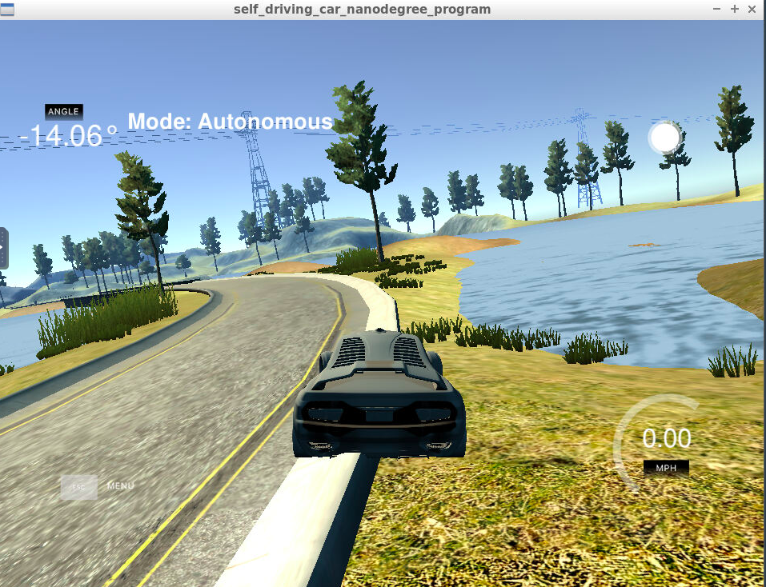
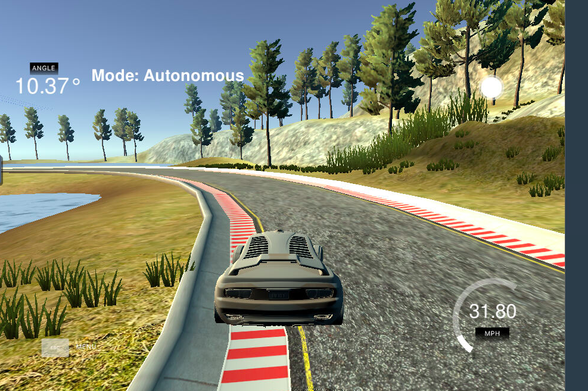
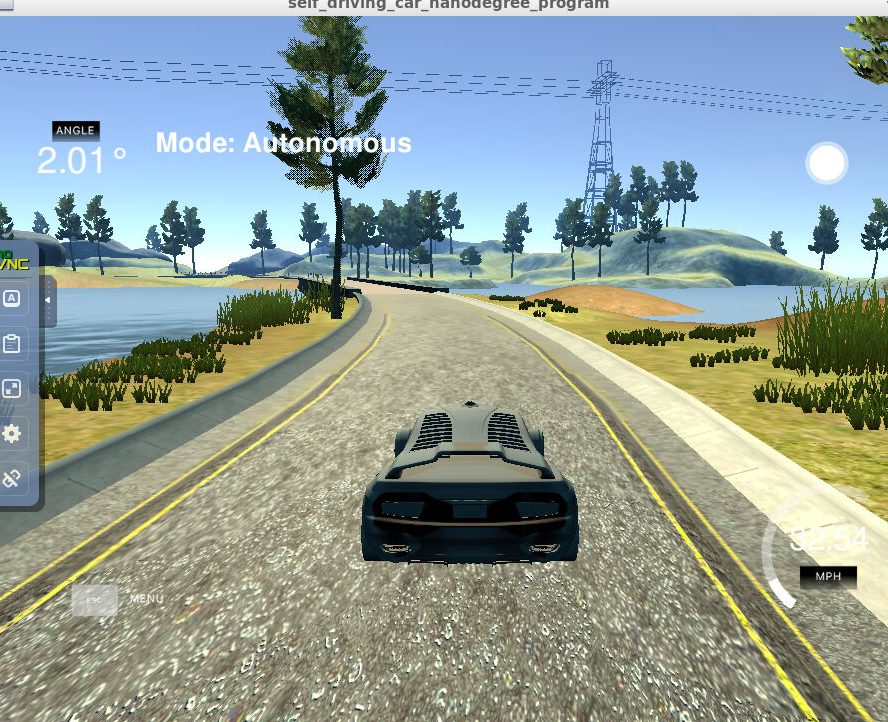

# CarND-Controls-PID
Self-Driving Car Engineer Nanodegree Program

# PID Controller 
PID stands for Proportional, Integral and Differential parameters required to compute the final steering angle that would be needed to maneuver the vehicle using the actuators in the car, against the Cross Track Error(Also could be referred to as the reference trajectory that the ego vehicle should ideally follow)

The following details describe the experiments tried out in the process of implementing the PID Controller:

# Algorithm
1. The Steering value is directly proportional to the cross track error. Thus, it must be represented as the product of the actual CTE and a constant. Let this constant be called as 'proportional constant' or tau_p. Therefore, steering value is given by steering_angle = -tau_p * CTE. 
2. Step 1 is implemented in PID.cpp file on lines 34-37. This experiment led to overshooting, because the steering does not countersteer. A new constant need to be added to address this. With time, the steering angle got higher and the vehicle ended up far too off from the track. Snapshot at the End. 
4. To address the problem in Step 2, A differential constant, tau_d was added to the equation. 
   Now the new steering angle is given by steering_angle = -tau_p * CTE - tau_d * (prev_cte - current_cte). This is implemented on lines 39-42 in pid.cpp file. The    overshooting problem was solved.
4. Finally, an integral CTE was added. This is used to address the initial misalignment of the wheels(or initial bias). Since in the simulator, assuming the wheels are perfectly aligned, this value was set to zero. 
5. The total error function is implemented in PID.cpp file from lines 29-31. These lines implement the final equation: steering_angle = -tau_p * CTE - tau_i * sum(CTE) - tau_d * (differential_cte)
6. Although twiddle is implemented on lines 49-93. More tuning of hyperparameters was still required for the maneuvers to be perfect. Therefore, the individual coefficients were manually tuned to reach the optimal maneuvers(Snapshots at the end)

(Image of the final algorithm output after manual tweaking at the end)


Only Proportional:
<p>
    
</p>

Twiddle
<p>
    
</p>
              
Final Result 
Twiddle
<p>
    
</p>
       

# Reflection
1. Twiddle algorithm is implemented on lines 49-93 in PID.cpp file. This algorithm can be improved by tuning the hyperparameters(p and dp), such that the values are computed by the algorithm instead of manually setting them. 
2. Even with tuning the parameters, there's slight overshoot and swaying. This could perhaps be improved by more tweaking of the parameters. 

---

## Dependencies

* cmake >= 3.5
 * All OSes: [click here for installation instructions](https://cmake.org/install/)
* make >= 4.1(mac, linux), 3.81(Windows)
  * Linux: make is installed by default on most Linux distros
  * Mac: [install Xcode command line tools to get make](https://developer.apple.com/xcode/features/)
  * Windows: [Click here for installation instructions](http://gnuwin32.sourceforge.net/packages/make.htm)
* gcc/g++ >= 5.4
  * Linux: gcc / g++ is installed by default on most Linux distros
  * Mac: same deal as make - [install Xcode command line tools]((https://developer.apple.com/xcode/features/)
  * Windows: recommend using [MinGW](http://www.mingw.org/)
* [uWebSockets](https://github.com/uWebSockets/uWebSockets)
  * Run either `./install-mac.sh` or `./install-ubuntu.sh`.
  * If you install from source, checkout to commit `e94b6e1`, i.e.
    ```
    git clone https://github.com/uWebSockets/uWebSockets 
    cd uWebSockets
    git checkout e94b6e1
    ```
    Some function signatures have changed in v0.14.x. See [this PR](https://github.com/udacity/CarND-MPC-Project/pull/3) for more details.
* Simulator. You can download these from the [project intro page](https://github.com/udacity/self-driving-car-sim/releases) in the classroom.

Fellow students have put together a guide to Windows set-up for the project [here](https://s3-us-west-1.amazonaws.com/udacity-selfdrivingcar/files/Kidnapped_Vehicle_Windows_Setup.pdf) if the environment you have set up for the Sensor Fusion projects does not work for this project. There's also an experimental patch for windows in this [PR](https://github.com/udacity/CarND-PID-Control-Project/pull/3).

## Basic Build Instructions

1. Clone this repo.
2. Make a build directory: `mkdir build && cd build`
3. Compile: `cmake .. && make`
4. Run it: `./pid`. 

Tips for setting up your environment can be found [here](https://classroom.udacity.com/nanodegrees/nd013/parts/40f38239-66b6-46ec-ae68-03afd8a601c8/modules/0949fca6-b379-42af-a919-ee50aa304e6a/lessons/f758c44c-5e40-4e01-93b5-1a82aa4e044f/concepts/23d376c7-0195-4276-bdf0-e02f1f3c665d)

## Editor Settings

We've purposefully kept editor configuration files out of this repo in order to
keep it as simple and environment agnostic as possible. However, we recommend
using the following settings:

* indent using spaces
* set tab width to 2 spaces (keeps the matrices in source code aligned)

## Code Style

Please (do your best to) stick to [Google's C++ style guide](https://google.github.io/styleguide/cppguide.html).

## Project Instructions and Rubric

Note: regardless of the changes you make, your project must be buildable using
cmake and make!

More information is only accessible by people who are already enrolled in Term 2
of CarND. If you are enrolled, see [the project page](https://classroom.udacity.com/nanodegrees/nd013/parts/40f38239-66b6-46ec-ae68-03afd8a601c8/modules/f1820894-8322-4bb3-81aa-b26b3c6dcbaf/lessons/e8235395-22dd-4b87-88e0-d108c5e5bbf4/concepts/6a4d8d42-6a04-4aa6-b284-1697c0fd6562)
for instructions and the project rubric.

## Hints!

* You don't have to follow this directory structure, but if you do, your work
  will span all of the .cpp files here. Keep an eye out for TODOs.

## Call for IDE Profiles Pull Requests

Help your fellow students!

We decided to create Makefiles with cmake to keep this project as platform
agnostic as possible. Similarly, we omitted IDE profiles in order to we ensure
that students don't feel pressured to use one IDE or another.

However! I'd love to help people get up and running with their IDEs of choice.
If you've created a profile for an IDE that you think other students would
appreciate, we'd love to have you add the requisite profile files and
instructions to ide_profiles/. For example if you wanted to add a VS Code
profile, you'd add:

* /ide_profiles/vscode/.vscode
* /ide_profiles/vscode/README.md

The README should explain what the profile does, how to take advantage of it,
and how to install it.

Frankly, I've never been involved in a project with multiple IDE profiles
before. I believe the best way to handle this would be to keep them out of the
repo root to avoid clutter. My expectation is that most profiles will include
instructions to copy files to a new location to get picked up by the IDE, but
that's just a guess.

One last note here: regardless of the IDE used, every submitted project must
still be compilable with cmake and make./

## How to write a README
A well written README file can enhance your project and portfolio.  Develop your abilities to create professional README files by completing [this free course](https://www.udacity.com/course/writing-readmes--ud777).

